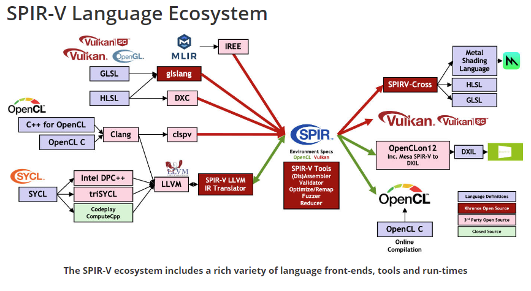

# vulKan学习
文档：
 1. 官方文档：[https://vulkan-tutorial.com/Introduction](https://vulkan-tutorial.com/Introduction);
 2. 中文翻译教程:[https://geek-docs.com/vulkan/vulkan-tutorial/vulkan-tutorial-index.html](https://geek-docs.com/vulkan/vulkan-tutorial/vulkan-tutorial-index.html)
 3. vulKan-hpp:[https://github.com/KhronosGroup/Vulkan-Hpp](https://github.com/KhronosGroup/Vulkan-Hpp);
 4. [SaschaWillems/Vulkan](https://github.com/SaschaWillems/Vulkan) （封装和机构比较好的Vulkan）;

## 一、环境搭建：
开发环境搭建集中在:[vulkan-development-environment-built-on-windows](https://geek-docs.com/vulkan/vulkan-tutorial/vulkan-development-environment-built-on-windows.html)中，配置基本一次就成功;

## 二、基本设置

## 三、vulkan中着色细分和SPIR-V：

### 着色器种类有：
1. 定点着色器（Vertex shaders）；
2. 曲面细分着色器（Tessellation shaders）;
3. 几何着色器(Geometry shaders);
4. 片段着色器(Fragment shaders)；
5. 计算着色器(Compute shaders);
6. ...（如NV mesh_shader,华为subpass shading）;
   
### Vulkan使用着色器为SPIR-V：
SPIR-V介绍:

原文翻译大致意思为：这种二进制格式叫做SPIR-V,他只为Vulkan和OPenCL设计的。这种格式被用来写图形着色器和计算着色器...（来自[Graphics_pipeline_basics](https://vulkan-tutorial.com/Drawing_a_triangle/Graphics_pipeline_basics/Shader_modules)第一段）;

